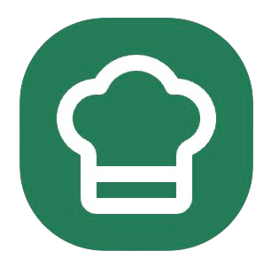
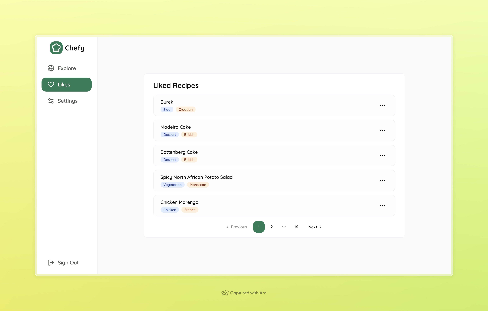
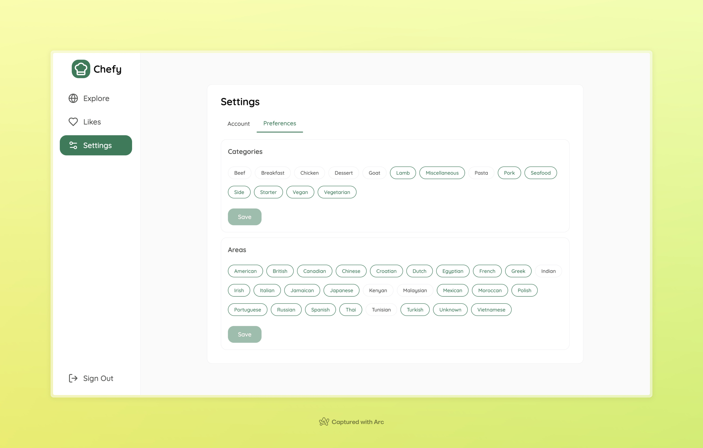

    
  <h1 align="center">Chefy</h3>
  

    An app that allows you to swipe and explore cooking recipes from around the world
  

  
  
  

## 📰 About The Project

 It's a web application built using NextJS 14 that enables users to discover recipes from different parts of the world. Additionally, users can save their favorite recipes and export them to PDF files!

## ️🔴 Live Preview

Click on this <b>[link](https://chefy-lm.vercel.app/)</b> to see a live app preview.

## 🔐 Login Credentials

**Email:** test@test.com  
**Password:** testtest

**OR**

You can <b>register</b> with your own credentials!

## ⚙ Features

- User authentication
- Explore recipes with selected preferences
- Browse liked recipes
- Export recipes to PDF
- Customize preferences

## 🧑‍💻 Built With

## 📋 Future plans

- Add Dark Mode compatibility
- Include the ability for users to add new recipes
- Add translations (polish language)

## 🗃️ Data source

Data collected from https://www.themealdb.com/
