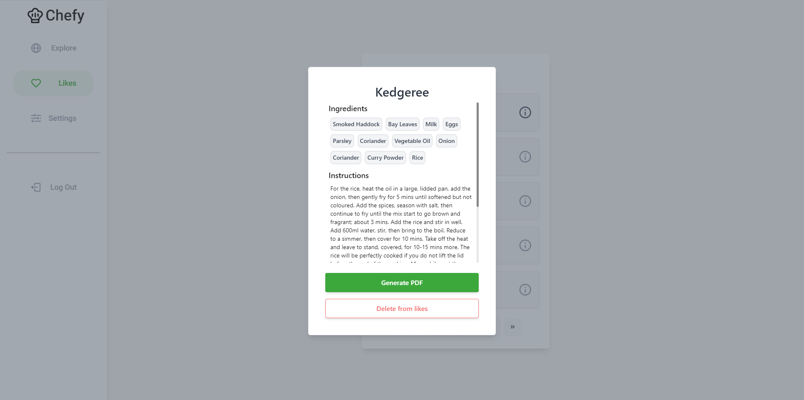

    
  <h1 align="center">Chefy</h3>
  

    Recipe app written in <b>NextJS</b> with a tinder-inspired design
  

  
  

## 📰About The Project

 It's a web application built using NextJS framework that enables users to discover recipes from different parts of the world. Additionally, users can save their favorite recipes and export them to PDF files.

## ️🔴 Live Preview

Click on this <b>[link](https://chefy.up.railway.app/)</b> to see a live app preview.

## 🔐 Login Credentials

**Email:** test@test.com  
**Password:** testtest

**OR**

You can <b>register</b> with your own credentials!

## ⚙ Features

- User authentication
- Explore recipes with selected preferences
- Browse liked recipes
- Export recipes to PDF
- Customize preferences

## 🧑‍💻 Built With

##

Data collected from https://www.themealdb.com/
